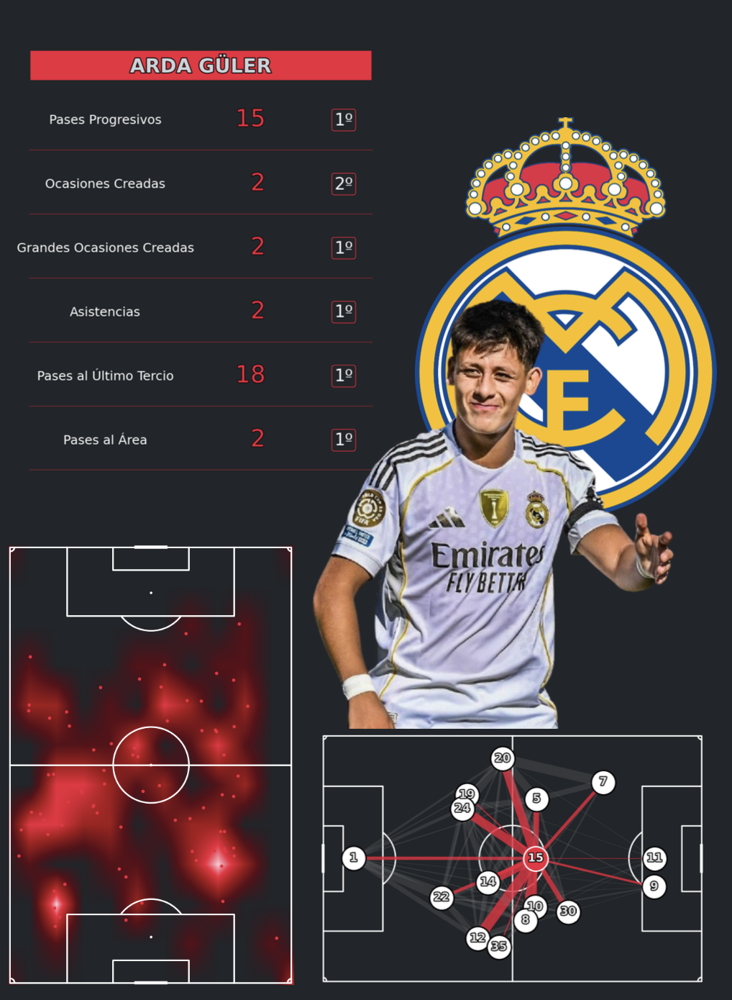
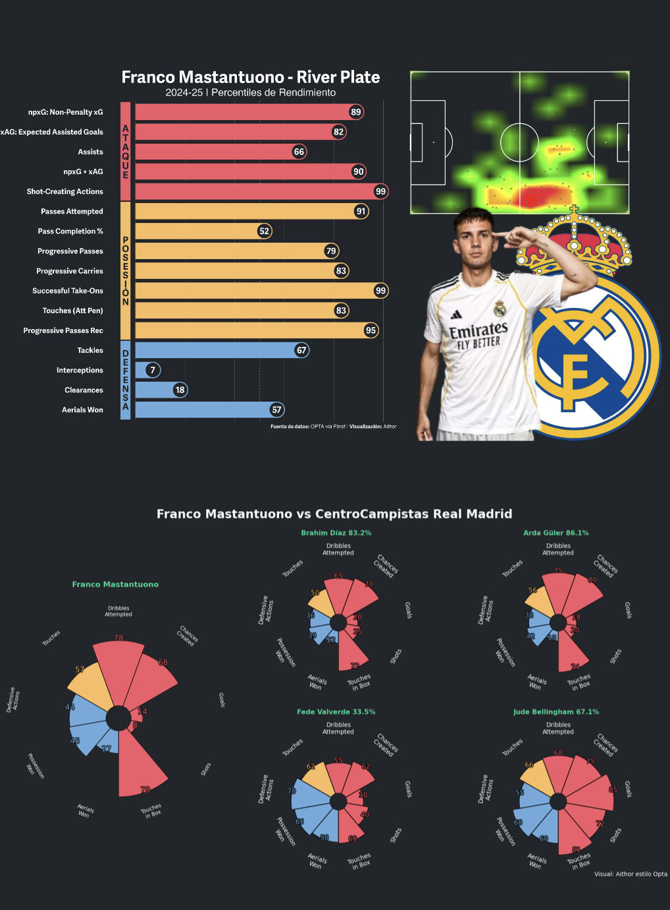

# 📂 Portafolio de Análisis Scout — Evaluación Cuantitativa de Rendimiento Futbolístico

Este repositorio contiene un conjunto de informes y visualizaciones desarrollados como parte de un **portafolio profesional de análisis scout**, con enfoque en el rendimiento individual de jugadores en competiciones de élite. El objetivo es ofrecer una evaluación objetiva y visual del desempeño futbolístico, apoyada en métricas clave y técnicas de análisis de datos avanzadas.

## 🧠 Objetivo del Proyecto

Desarrollar herramientas de evaluación y seguimiento de talento futbolístico mediante el uso de datos estructurados (event data, tracking, métricas avanzadas), orientadas a:

- **Scouting profesional** (pre-competencia, intra-competencia, post-competencia)  
- **Toma de decisiones** en clubes, agencias y medios  
- **Benchmarking posicional** entre jugadores  
- **Identificación de perfiles óptimos por rol/táctica**

## 📊 ¿Qué Contiene el Portafolio?

- Informes individuales y comparativos por posición (delanteros, centrocampistas, defensas, porteras)
- Visualizaciones personalizadas tipo radar, scatter plots, mapas de tiro y cadenas de posesión
- Métricas agregadas: **Goles, xG, Asistencias, xA, Disparos, Pases Clave, Carries, Pressing, Recuperaciones**
- Datos normalizados por 90 minutos y filtrados por condiciones mínimas (minutos, posición, contexto táctico)

## 🛠️ Herramientas Utilizadas

- **Python**: pandas, numpy, matplotlib, mplsoccer, seaborn  

> Cada informe está diseñado para ser **reproducible y trazable**, con separación clara entre código, datos y visuales exportadas.

## 🖼️ Ejemplos Visuales

### 🔹 Informe individual: Arda Güler


### 🔹 Informe comparativo: Franco Mastantuono vs centrocampistas Real Madrid



> Visualizaciones generadas con `matplotlib`, `mplsoccer` y `seaborn`. Diseño visual inspirado en estilo Opta y radar charts personalizados.

## 🗂️ Estructura del Repositorio

```
Portafolio-Scout/
│
├── reports/             # Informes PDF visuales (uno por jugador o posición)
├── data/                # Datos brutos y procesados (CSV, JSON, XLSX)
├── scripts/             # Códigos en Python o R para análisis y gráficos
├── img/                 # Visualizaciones exportadas (.png)
└── README.md            # Este archivo
```

## 📈 Enfoque Analítico

- 🔍 **Contextualización táctica**: No solo métricas brutas, sino su interpretación dentro del sistema de juego.  
- 🔁 **Comparación posicional**: Evaluación relativa según función táctica.  
- 📐 **Modelado estadístico**: Uso de modelos predictivos para estimar impacto.  
- 💡 **Visualización avanzada**: Diseño profesional y atractivo para perfiles técnicos y ejecutivos.

## 💼 Autor

**Aithor**  
Consultor de datos | Analista de rendimiento en fútbol | Especialista en scouting cuantitativo  
Experiencia en integración de datos de eventos, visualización avanzada, modelos predictivos y automatización de reportes.
